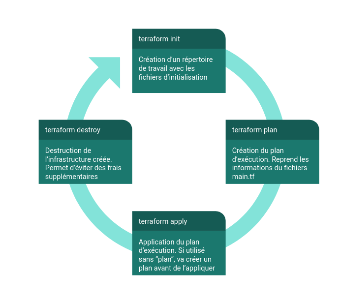
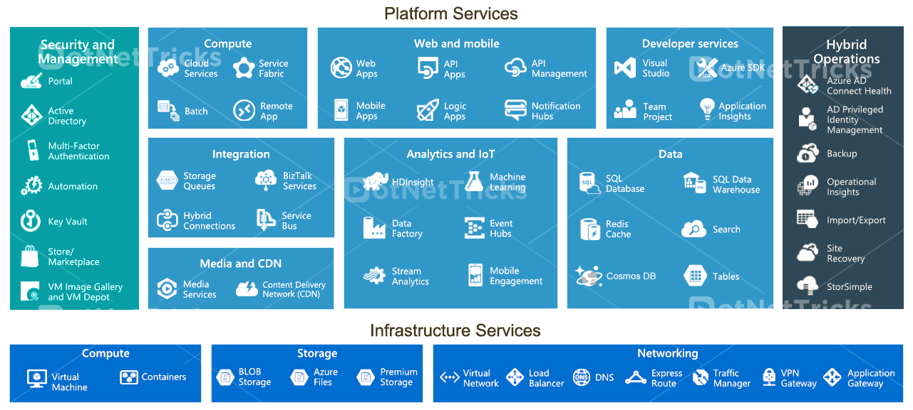

# Initiation à Terraform et GCP (Google Cloud Platform)

**Pré-requis :** 
- Installer [Terraform](https://www.terraform.io/)
- Avoir un compte Google Cloud Platform
- Installer [GCP SDK](https://cloud.google.com/sdk/docs/install-sdk)

## Terraform

### Présentation de Terraform

Terraform est un outil qui permet de générer des infrastructures à partir d'un code. C'est ce que l'on appelle un IaC (Infrastructure As a Code). Terraform utilise une méthode déclarative, c'est-à-dire qu'il va contenir les informations nécessaires à la création de notre infrastructure Cloud sous forme de déclaration. Il est possible de l'utiliser avec les trois principaux cloud provider que sont AWS, Azure et GCP. Dans l'exemple suivant, on va l'utiliser avec GCP. Si on veut l'utiliser avec un autre cloud provider, la structure sera identique. Il suffira juste de changer quelques informations. Pour cela, il ne faut pas hésiter à consulter la documentation pour avoir les informations nécessaires. 

### Projets crées

Pour construire l'infrastructure dont on a besoin, on va créer des fichiers de configurations : `main.tf` et `variables.tf`. Dans le fichier `main.tf`, on va retrouver les informations des services que l'on souhaite créer en fonction de notre cloud provider. Ici, on va créer un Data Lake (**Google Storage Bucket**) et un Data Warehouse (**Google BigQuery**). Le fichier `variables.tf` va contenir les informations nécessaires à la configuration des différents produits utilisés. 

### Le cycle de vie de Terraform

On va avoir 3 (4 étapes) dans le cycle de vie d'une infrastructure avec Terraform. 

#### 1) terraform init

La commande `init` permet de créer un répertoire de travail qui va contenir les informations nécessaires à Terraform. C'est l'équivalent de commande `init` que l'on retrouve dans d'autres outils comme `git init`.

#### 2) terraform plan

La commande `plan` permet de créer le plan d'exécution. Il va se baser sur les informations contenues dans les fichiers de configuration `main.tf` et `variables.tf`.

#### 3) terraform apply

Lors de l'utilisation de la commande `apply`, le plan d'exécution crée au préalable va être mis en place. L'infrastructure va se construire (et se modifier) en se basant sur les informations présentes dans les fichiers de configuration. Si la commande `plan` n'a pas été réalisé avant le plan d'exécution est automatiquement construit. Cette opération prend quelques secondes à être réalisé. 

#### 4) terraform destroy

Enfin lorsque l'on n'a plus besoin de l'infrastructure crée dans le cloud, on va la détruire à l'aide de la commande `destroy`. La destruction d'une infrastructure sur le cloud est recommandée pour éviter la génération de frais supplémentaires lorsqu'on ne l'utilise pas et que sa sauvegarde n'est pas nécessaire. 

## Google Cloud Platform

### Description de GCP et de ces services

Google Cloud Platform (ou GCP) est un cloud provider. On retrouve trois grands cloud provider : Amazon Web Services (AWS), Microsoft Azure (Azure) et Google Cloud Platform (GCP). Quelle que soit le cloud provider de son choix le principe reste souvent le même. Ici, on va faire un focus sur GCP mais cela est tout à fait applicable à AWS ou Azure. Les services présentés par Google existent sous d'autres appelations pour AWS et Azure.

GCP comprend de nombreux outils qui sont résumés dans l'illustration ci-dessous. 

###  Utilisation du SDK

Pour pouvoir utiliser plus simplement, des outils comme Terraform, il est conseillé de télécharger le SDK (lien présent plus haut). Il va aussi falloir créer des clés pour les utilisateurs et enregistrer ces clés pour utiliser de manière optimale GCP en ligne de commande. 

[Authentification avec GCP](https://cloud.google.com/docs/authentication/getting-started#auth-cloud-implicit-python)

## Ressources pour AWS et Azure

Comme il a été expliqué plus haut ce qui a été présenté avec Terraform et GCP peut aussi être fait avec AWS et Azure. Pour ceux qui voudraient utiliser Terraform sur un autre cloud provider, voici quelques ressources.

### Amazon Web Services

- [Configuration Terraform avec AWS](https://learn.hashicorp.com/tutorials/terraform/aws-change?in=terraform/aws-get-started)
- [Amazon SDK](https://aws.amazon.com/fr/cli/)

### Microsoft Azure

- [Configuration Terraform avec Azure](https://learn.hashicorp.com/tutorials/terraform/azure-build?in=terraform/azure-get-started)
- [Azure SDK](https://docs.microsoft.com/fr-fr/cli/azure/install-azure-cli)

