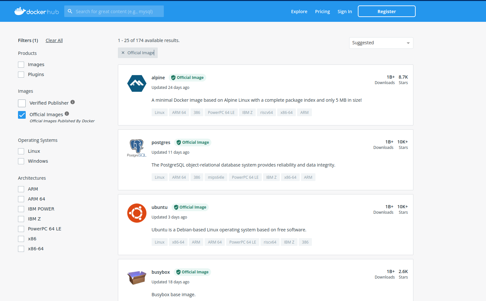

# Docker & Ingestion de données

## Docker

Docker est un logiciel qui permet de créer des boîtes que l'on appelle **container**. Dans un container, on va retrouver un script avec toutes les dépendances nécessaires pour le faire tourner. Par exemple, si on a crééé un pipeline d'ingestion de données, on va retrouver le script nécessaire à cette ingestion ainsi que les différents éléments nécessaires au bon fonctionnement de ce script comme les librairies Python nécessaires comme Pandas, Numpy, *etc*. L'avantage de cette méthode, c'est que l'on permet à notre programme de fonctionner sur n'importe quelle machine. 

[Présentation de Docker](https://www.docker.com/products/personal/)

## Dockerfile

Pour construire une image Docker, il faut créer un fichier `Dockerfile`. Dans ce fichier, on retrouvera les différents éléments de notre programme. On va lui notifier les dépendances à télécharger pour que cela fonctionne. Voici quelques conseils sur les bonnes pratiques de rédaction d'un fichier [`Dockerfile`](https://docs.docker.com/develop/develop-images/dockerfile_best-practices/).

## Principales commandes

Pour faire fonctionner des containers Docker, on va utiliser principalement deux commandes `build` et `run`.
La commande `build` va construire une image de notre container. Pour faire cela, elle va télécharger les composants nécessaires au bon fonctionnement de notre script. Si on reprend l'exemple du script présent ici, on téléchargera : Python 3.9, Pandas, Psycog2, SqlAlchemy et wget pour Ubuntu. Une fois notre image construite, on va pouvoir la lancer.

Pour lancer l'exécution d'une image Docker, on va utiliser la commande `run` à laquelle on peut ajouter les paramètres `-t` pour lui dire que l'on veut l'utiliser en mode interactif. 

## Docker Compose

[Docker Compose](https://docs.docker.com/compose/) permet l'orchestration de containers Docker, c'est-à-dire qu'il sera possible de créer plusieurs images Docker pour ensuite les lancer les unes à la suite des autres pour lancer son programme. Le fichier docker-compose possède une extension *.yaml*.

Dans notre exemple, on s'intéresse à la construction d'une base de données avec PostgreSQL. Pour cela, il va aussi nous falloir télécharger PostgreSQL et pgAdmin puis exécuter notre script `ingest_data.py` avec le téléchargement des différentes dépendances nécessaires. Pour gagner du temps et éviter les erreurs ou les oublis, il est possible de procéder à une orchestration des différents containers à l'aide de l'outil Docker Compose. 

## Docker Hub

[Docker Hub](https://hub.docker.com/) est une plateforme qui permet d'envoyer ces images Docker sur une plateforme dans le but de les rendre disponible pour tous. On va aussi y retrouver des images d'outils dont on pourrait avoir besoin. 

## SQL

SQL est un langage de programmation très utilisé pour le requêtage de bases de données relationnel. Une fois que l'on aura construit notre base de données et qu'on aura ingérer nos données, il sera possible d'utiliser le langage SQL pour obtenir des informations mais aussi pour pouvoir réaliser de puissantes analyses de données. 

- [Généralités sur le SQL](https://sql.sh/)
- [Cours d'introduction au SQL](https://en.khanacademy.org/computing/computer-programming/sql)
- [Un livre pour ceux qui veulent aller plus loin](https://www.oreilly.com/library/view/sql-for-data/9781492088776/)

Source : [Adapté du bootcamp de DataTalksClub](https://github.com/DataTalksClub/data-engineering-zoomcamp/tree/main/week_1_basics_n_setup/2_docker_sql)
