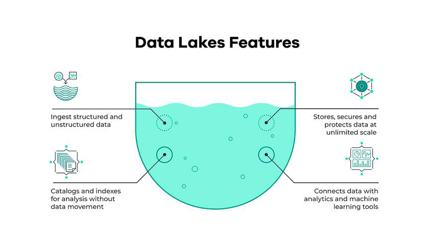
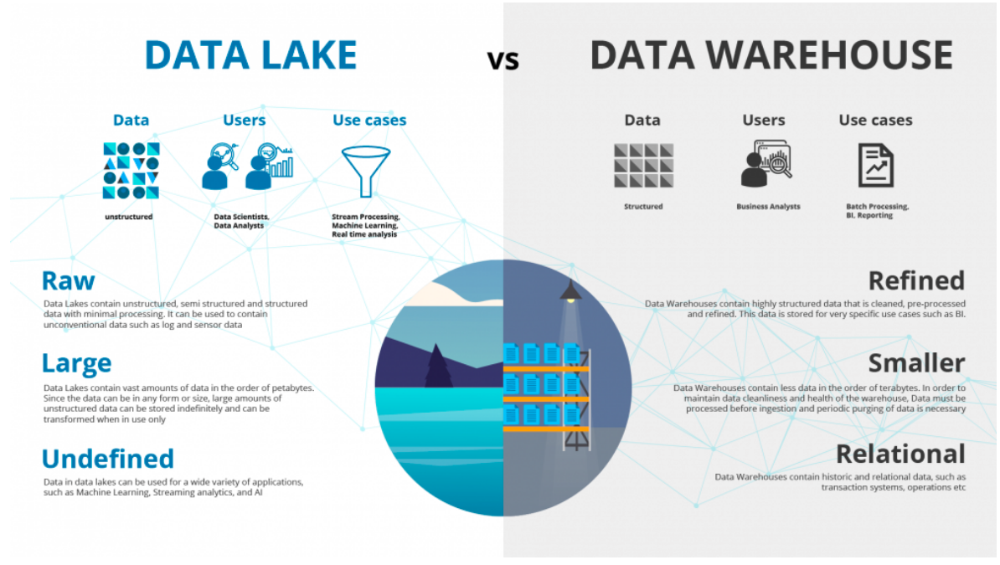

# Data Ingestion

## Data Lake

Un Data Lake est un endroit où on stocke de nombreuses données venant de plusieurs sources de données. On les utilise aussi bien pour du Machine Learning que des applications Analytics. Un Data Lake doit être sécurisé et on veut avoir accès à ces données le plus rapidement possible. 

### Data Lake vs Data Warehouse

Dans un data lake les données ne sont pas structurées. Les usagers sont des data scientists ou des data analysts. Le nombre de données présentés sont importants (de l'ordre du Pétaoctet). Dans un data warehouse, les données sont structurées. Les utilisateurs sont des data analysts et les données sont moins importantes à l'intérieur. 

### Data Lake et Cloud Providers

Selon le cloud provider, le Data Lake se fera avec différents services : 
- **S3** pour **AWS**
- **Azure Blob** pour **Azure**
- **Cloud Storage** pour **GCP**

## Orchestration d'un workflow d'ingestion

La semaine dernière, on avait crée un data pipeline en une seule étape. Avec un seul script, on téléchargeait un fichier au format csv et ensuite on l'envoyait dans une base de données PostgreSQL.
Cette semaine, on va compliquer les choses en faisant quelque chose de beaucoup plus sécurisée. On va séparer notre script en plusieurs étapes pour créer un workflow permettant l'ingestion de données dans notre datalake. Tout d'abord, on va télécharger les données provenant du site de la [ville de New York](https://www1.nyc.gov/site/tlc/about/tlc-trip-record-data.page). Après avoir téléchargé ces données au format *csv*, on va les transformer en un format plus optimal qui est le format *parquet* ([Définition du format parquet](https://databricks.com/fr/glossary/what-is-parquet)), les données au format parquet vont être ingérer dans Google Cloud Storage et enfin, on va créer une base de données avec BigQuery que l'on pourra requêter avec des requêtes SQL. 

Pour orchestrer ce workflow, on va retrouver plusieurs outils : 
- [Luigi](https://luigi.readthedocs.io/en/stable/index.html),
- Apache Airflow,
- [Prefect](https://www.prefect.io/)

## Airflow

- [Documentation pour créer un DAG](https://airflow.apache.org/docs/)

*Source :* [Repo GitHub](https://github.com/DataTalksClub/data-engineering-zoomcamp/tree/main/week_2_data_ingestion)

